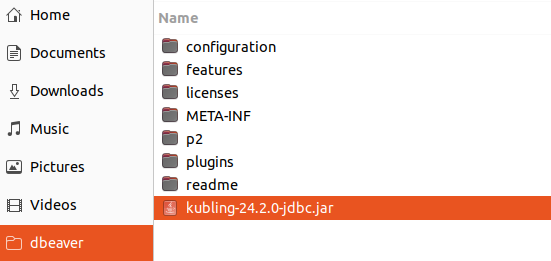
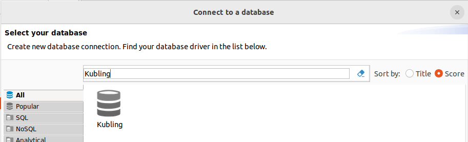

# Configure DBeaver

### 1. Download DBeaver
Go to https://dbeaver.io/download/ and download latest version.

### 2. Download Driver
There are two options to connect to `Kubling`, using the standard PostgreSQL protocol or the native protocol. 
In DBeaver you can use both, however, when using PostgreSQL, DBeaver will try to fetch the medatada from `Kubling` 
using the same interface and `SYS` tables as a regular PostgreSQL which are not fully compatible. 
In short, you will be able to execute queries, but you won't be able to see `VDB` metadata.

That is why we recommend the use of the native protocol when interacting with the engine via clients like DBeaver.

You first need to have the `Kubling` native driver on your local machine. 
Drivers are [published here](https://github.com/kubling-community/kubling-teiid-os/releases), download latest version and
place it, ideally, in the same directory you installed DBeaver.

### 3. Register Driver
In the top menu, select `Database` > `Driver Manager` and then, in the popup window, press `New`. 

First click on `Libraries` tab and then `Add File`. Then select the recently-downloaded driver:

Go back to `Settings` tab and give the driver a name, like `Kubling`.  
Fill the `Class name` field with `com.kubling.teiid.jdbc.TeiidDriver`. 
Leave all other fields blank and press `OK`.

### 4. Connect to VDB
In the top toolbar, just below the main menu, click on `New Database Connection`. 

Filter `Driver` by name:

The connection string has the following components: 
`jdbc:teiid:[vdb]@mm://[address]:[port]`

Suppose that you are trying the `appmodel` sample running in `localhost` using default port, so you connection string will be: 
`jdbc:teiid:app@mm://localhost:35482`

Since that sample does not use `RBAC`, just leave `Username` and `Password` blank.

At the bottom of the `Connect to a Database` popup, there is a button that allows you to test the connection, if everything
works as expected, you should see a message saying the connection was successful.

You can now explore `Schemas`, `Tables`, `Columns` and other VDB objects and, of course, write SQL in much better and assisted way.